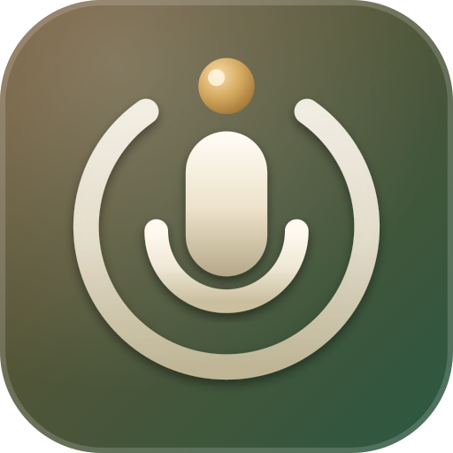

<p align="center">
  
</p>

# NeoRecall

**Private, self-hosted audio memory — recorded anywhere, transcribed locally, and recalled naturally.**

 

## Install

```bash
npm i -g neorecall
neorecall install
neorecall setup
neorecall start
```

Open `http://localhost:4500`.

## What makes it different

**Audio stays under your control.** Clients retain every chunk until the server proves its transcript is durable and its temporary audio copy is gone.

**Transcription and search are local.** CPU inference, multilingual embeddings, FTS5, and sqlite-vec keep the continuous path free of paid tokens.

**LLMs are rare and budgeted.** OpenRouter is called only for eligible memory consolidations and explicit Ask searches, with durable rate gates.

**Offline first.** Browser and desktop clients buffer independently decodable chunks and resume idempotent uploads when the server returns.

## Project status

NeoRecall is in beta. Web, macOS 13+, and Windows 10/11 x64 are the v1 clients. Desktop is the reference client for uninterrupted recording; browser capture remains subject to browser permission and lifecycle limits.

## Documentation

See `docs/docs/installation.md`, `docs/docs/privacy-and-consent.md`, and `docs/docs/architecture.md`.

## License

NeoRecall is licensed under the GNU Affero General Public License v3.0 only.
